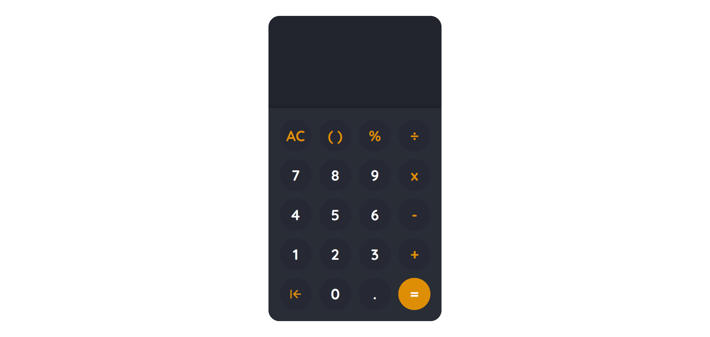

# [Simple calculator]
This is an online javascript scientific calculator, designed and coded by Nitin Ekka. This can do simple everyday calculations. 
Note: It is not a scientific calculator and hence doesn't have trigrometric functions or any other function.
</a>

